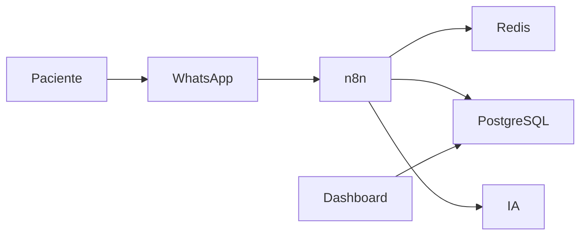
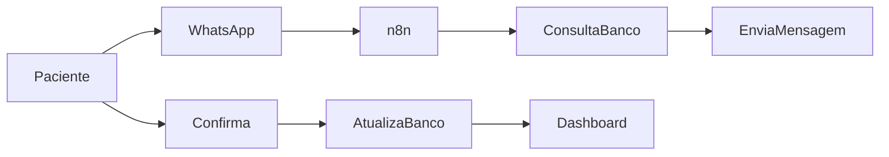
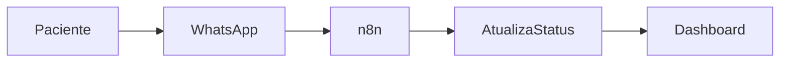
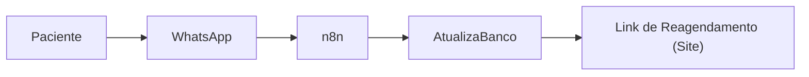
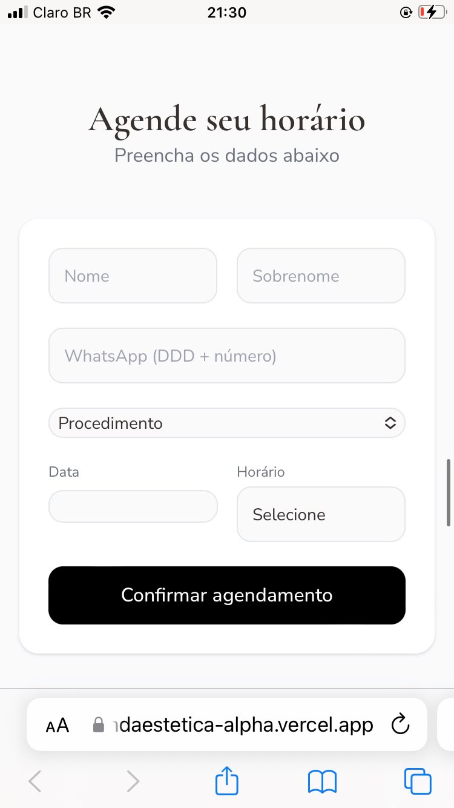
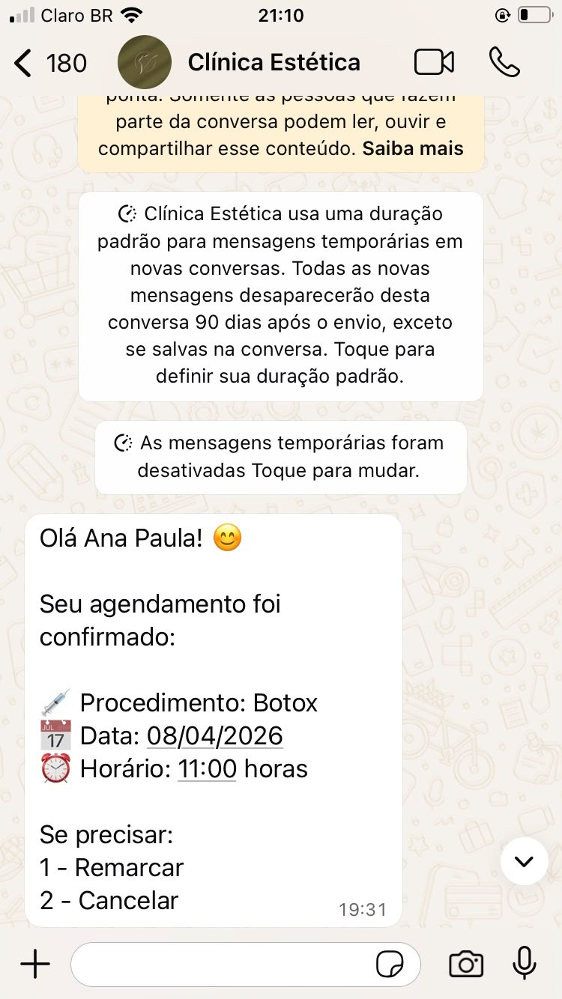
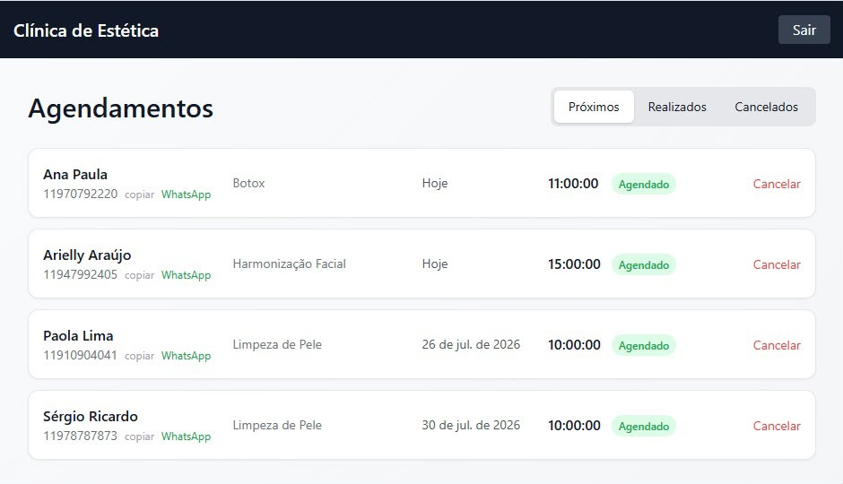
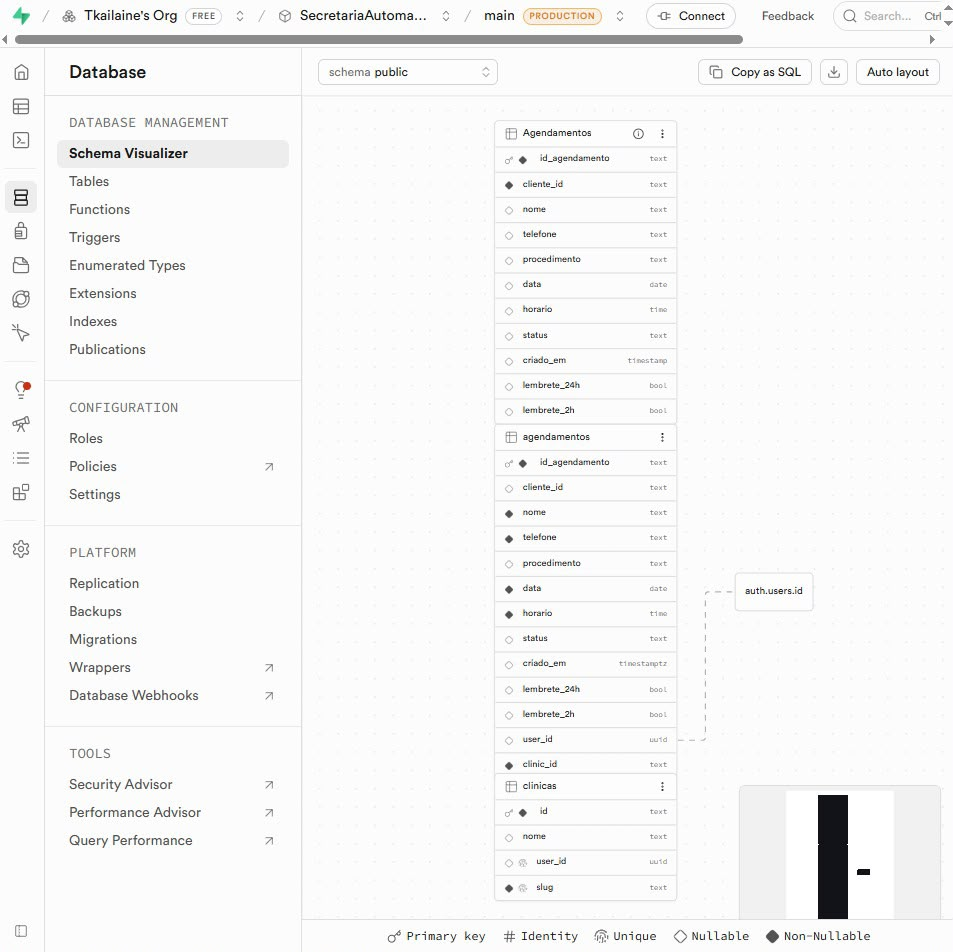

# 🤖 Micro SaaS de Automação para Clínicas de Estética

> Plataforma **multi-tenant** para automação do relacionamento com pacientes via WhatsApp, desenvolvida para reduzir tarefas operacionais, diminuir faltas por esquecimento e centralizar a comunicação entre clínicas e pacientes.

> **Status:** 🔒 Código proprietário  
> Este repositório documenta a arquitetura, decisões técnicas e aprendizados do projeto. O código-fonte não é público por motivos de propriedade intelectual.

---

# 📖 Visão Geral

Clínicas de estética costumam realizar dezenas de procedimentos recorrentes por semana — como limpezas de pele, aplicações, sessões de manutenção e tratamentos contínuos.

Na maioria das clínicas, todo o relacionamento com o paciente é feito manualmente pela recepção via WhatsApp.

Isso significa que uma pessoa precisa diariamente:

- confirmar consultas;
- enviar lembretes;
- reagendar horários;
- responder dúvidas simples;
- registrar manualmente alterações.

Além do tempo gasto, todo esse processo depende da memória e organização da equipe, gerando inconsistências e aumentando a chance de faltas por esquecimento.

O objetivo deste projeto nunca foi criar apenas mais um sistema de agendamento.

A proposta foi construir uma **camada de automação inteligente**, capaz de conversar com os pacientes utilizando o canal que eles já utilizam (WhatsApp), automatizando boa parte desse relacionamento sem exigir mudanças na rotina da clínica.

Desde o início, a arquitetura foi pensada para ser **multi-tenant**, permitindo que diversas clínicas utilizem a mesma plataforma com isolamento completo de dados.

---

# 🚨 Problema

## Processos manuais identificados

- Confirmação individual de consultas via WhatsApp.
- Envio manual de lembretes.
- Cancelamentos tratados manualmente.
- Reagendamentos realizados pela recepção.
- Dependência de colaboradores específicos para execução das rotinas.

## Principais riscos

- Pacientes esqueciam consultas.
- Perda de faturamento por faltas.
- Sobrecarga da recepção.
- Atendimento inconsistente.
- Falta de padronização dos processos.

## Limitações das soluções existentes

Os sistemas tradicionais de agendamento organizam a agenda, porém normalmente não automatizam o relacionamento com o paciente.

Além disso, poucas soluções são projetadas desde o início para operar em ambiente **multi-tenant**, compartilhando infraestrutura com isolamento lógico entre clientes.

---

# 🎯 Objetivos da Solução

## Objetivos de negócio

- Reduzir trabalho operacional da recepção.
- Diminuir faltas por esquecimento.
- Automatizar o relacionamento com pacientes.
- Criar uma plataforma reutilizável para múltiplas clínicas.
- Reduzir o custo operacional por novo cliente.

## Funcionalidades principais

- Envio automático de lembretes.
- Confirmação de consultas via WhatsApp.
- Cancelamento automatizado.
- Reagendamento automatizado.
- Atendimento inicial com IA.
- Dashboard administrativo.
- Gestão centralizada de pacientes.

## Requisitos técnicos

- Arquitetura Multi-tenant.
- Banco de dados relacional.
- Persistência do contexto das conversas.
- Infraestrutura containerizada.
- Escalabilidade horizontal.
- Separação clara entre automação, banco de dados e interface administrativa.

---

# 🏗 Arquitetura

## Visão Geral

---

## Separação de Componentes

### 📱 Camada de Canal

Responsável exclusivamente pela comunicação com o WhatsApp.

Funções:

- receber mensagens;
- enviar mensagens;
- encaminhar eventos para a automação.

---

### ⚙ Camada de Automação

Toda a lógica de negócio foi centralizada no **n8n**.

Essa camada é responsável por:

- identificar o contexto da conversa;
- decidir se o paciente deseja confirmar, cancelar ou reagendar;
- consultar banco de dados;
- disparar integrações;
- acionar IA quando necessário.

---

### 🗄 Camada de Dados

O PostgreSQL/Supabase atua como fonte oficial das informações persistentes.

Armazena:

- clínicas;
- pacientes;
- profissionais;
- procedimentos;
- agendamentos;
- lembretes.

O Redis é utilizado para:

- estado temporário das conversas;
- filas;
- controle de contexto;
- informações transitórias.

---

### 🖥 Dashboard Administrativo

A interface administrativa consome diretamente a base de dados.

Nenhuma regra de negócio é implementada no dashboard.

Toda decisão permanece na camada de automação.

Essa escolha reduz duplicação de lógica e facilita manutenção.

---

# 🔄 Fluxo de Dados

> 

---

# 🔄 Fluxos Principais

## Confirmação de Consulta

---

## Cancelamento

---

## Reagendamento

---

# 🧠 Principais Decisões de Arquitetura

## Por que utilizar n8n?

A lógica deste projeto é orientada a eventos.

Mensagem recebida.

Decisão.

Integração.

Nova ação.

O n8n permitiu iterar rapidamente sobre regras de negócio sem a necessidade de desenvolver uma infraestrutura própria de mensageria.

---

## Por que PostgreSQL/Supabase?

Os dados possuem forte relacionamento entre si.

Um agendamento sempre pertence a:

- uma clínica;
- um paciente;

O PostgreSQL garante integridade relacional enquanto o Supabase acelera autenticação e disponibilização de APIs.

---

## Por que Redis?

Conversas são altamente transitórias.

Não fazia sentido utilizar o banco relacional para armazenar estados temporários.

O Redis mantém contexto das conversas e auxilia na fila de lembretes.

---

## Escalabilidade

A automação foi separada da persistência de dados.

Essa divisão permite escalar:

- banco;
- automação;
- interface;

de maneira independente.

---

## Arquitetura Multi-tenant

Foi adotado isolamento lógico utilizando **tenant_id**.

Essa estratégia reduz custo operacional e mantém uma única infraestrutura para múltiplos clientes.

---

## Separação de responsabilidades

Toda regra de negócio reside na camada de automação.

O dashboard apenas consome dados.

Isso evita divergência entre interface e automação.

---

# 👩‍💻 Minha Contribuição

Fui responsável por toda a arquitetura funcional da solução.

Minha atuação incluiu:

- modelagem do banco de dados;
- definição das regras de negócio;
- construção dos workflows de automação;
- integração entre WhatsApp e banco de dados;
- arquitetura multi-tenant;
- configuração da infraestrutura com Docker, PostgreSQL e Redis;
- definição da comunicação entre serviços;
- validação dos fluxos de atendimento.

O dashboard administrativo foi desenvolvido com apoio de ferramentas de IA para acelerar a implementação da interface.

Minha responsabilidade nessa etapa concentrou-se em:

- definição dos requisitos;
- modelagem dos dados;
- regras de acesso por tenant;
- validação funcional;
- integração com o restante da plataforma.

---

# 📚 Aprendizados

O principal desafio foi projetar uma arquitetura multi-tenant desde o início.

Isso exigiu tratar o isolamento por **tenant_id** como parte obrigatória de toda regra de negócio.

Também compreendi a importância de separar completamente:

- interface;
- automação;
- persistência;
- integrações.

Se fosse iniciar novamente hoje, adicionaria testes automatizados específicos para validar isolamento entre tenants e regras críticas de automação.

Este projeto representou uma mudança importante na minha forma de desenvolver software, levando-me a pensar primeiro na arquitetura e escalabilidade da solução antes da implementação.

---

# 🛠 Tecnologias

- n8n
- PostgreSQL
- Supabase
- Redis
- Docker
- React
- TypeScript
- Inteligência Artificial
- Evolution API

---

# 🖼 Galeria

## Landing Page de Entrada da Plataforma

Primeiro ponto de contato do paciente, desenvolvido para direcionar o usuário ao agendamento do procedimento estético.

---

## Formulário de Agendamento

Formulário em tempo real de disponibilidade de serviços e horários disponíveis para agendar procedimento.

---

## Fluxo Automatizado de Confirmação de Agendamentos via WhatsApp

Exemplo de confirmação automática enviada ao paciente, permitindo confirmar, reagendar ou cancelar o atendimento diretamente pela conversa.

---

## Dashboard Administrativo para Gestão de Agendamentos

Painel utilizado pela clínica para acompanhar pacientes, consultas, status dos agendamentos e informações operacionais.

---

## Modelagem Inicial do Banco de Dados

Estrutura relacional utilizada durante o desenvolvimento da plataforma, demonstrando entidades, relacionamentos e organização das informações.

---

# 📄 Licença

Este repositório possui finalidade exclusivamente demonstrativa para portfólio profissional.

O código-fonte permanece privado por conter propriedade intelectual desenvolvida para fins comerciais.
